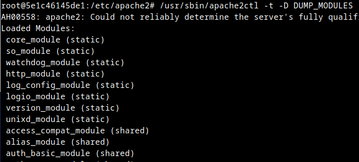

# HTTPS, Hsts, Hardening de servidor web  .
Tenemos como objetivo:

>
> - Conocer cómo configurar un servidor Apache.
> 
> - Conocer el funcionamiento de HTTP y HTTPS.
>
> - Crear certificados en nuestro servidor.
>
> - Saber configurar nuestro servidor para utilizar HTTPS.
>
> - Conocer HTST
>
> - Conocer los Firewall de aplicaciones (WAF)

# ACTIVIDADES A REALIZAR
---
> Lee detenidamente el siguiente documento [para conocer la configuración básica de Apache ](./files/1-Configuracion-Basic-Apache.pdf)
>
> Lee detenidamente el siguiente documento [para conocer las bases del protocolo HTTP ](./files/2-Protocolo-HTTP.pdf)
>
> Lee detenidamente el siguiente [documento para conocer cómo podemos securizar nuestro servidor web ](./files/3-Hardening-Servidor.pdf)
>

Vamos realizando operaciones:

## Iniciar entorno de pruebas

-Situáte en la carpeta de del entorno de pruebas de nuestro servidor LAMP e inicia el escenario docker-compose

~~~
docker-compose up -d
~~~

## Instalación de Apache
---

Cómo estamos utilizando un escenario docker-compose, para acceder a nuestra máquina tendremos que ejecutar:

~~~
docker exec -it lamp-php83 /bin/bash
~~~

Nuestro contenedor que contiene el servicio web, como ves se llama lamp-php83. Si la carpeta donde tienes el escenario tiene otro nombre diferente de lamp, tendrás que cambiar el nombre.

En nuestro servidor ya tenemos instalado Apache, no obstante en cualquier máquina Linux, podemos instalar un servidor Apache, instalando el paquete `apache2`.

~~~
apt update
apt install apache2
~~~

Si no estás utilizando el entorno de pruebas sino otra máquina no estás con usuario `root`es posible que tengas que poner delante de los comandos `sudo`.

 
## Estructura de directorios de configuración Apache

El directorio donde nos encontraremos los archivos de configuración de Apache es `/etc/apache2`. Allí encontraremos los siguientes directorios de configuración que incluyen archivos de configuración (con extensión .conf). 

       /etc/apache2/
       |-- apache2.conf
       |       `--  ports.conf
       |-- mods-enabled
       |       |-- *.load
       |       `-- *.conf
       |-- conf-enabled
       |       `-- *.conf
       `-- sites-enabled
       |        `-- *.conf
       `-- sites-available
               `-- *.conf
#
El archivo de configuración global es `/etc/apache2/apache2.conf`. En él podemos leer detalladamente la configuración explicada.

Los `**Modulos**` son módulos o archivos, que aportan una funcionalidad específica al servidor Apache. Por ejemplo el módulo `ssl.conf` nos sirve para utilizar el protocolo ssl en apache y así utilizar https.

Tenemos el directorio `/etc/apache2/mods-available` donde podemos encontrar todos los módulos disponibles para nuestro servidor (estén o no operativos).

En el directorio `/etc/apache2/mods-enabled` están los módulos que tenemos instalados, o habilitados, es decir los que queremos que nos añadan funcionalidad a apache.

Podemos ver los módulos que tenemos instalados con el comando:

~~~
apache2ctl -t -D DUMP_MODULES
~~~

Para añadir la funcionalidad de un módulo a aa

## **Código seguro**
---

Aquí está el código securizado:

🔒 Medidas de seguridad implementadas

- :

        - 

        - 

🚀 Resultado

✔ 

✔ 

✔ 

## ENTREGA

> __Realiza las operaciones indicadas__

> __Crea un repositorio  con nombre PPS-Unidad3Actividad6-Tu-Nombre donde documentes la realización de ellos.__

> No te olvides de documentarlo convenientemente con explicaciones, capturas de pantalla, etc.

> __Sube a la plataforma, tanto el repositorio comprimido como la dirección https a tu repositorio de Github.__

