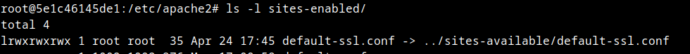
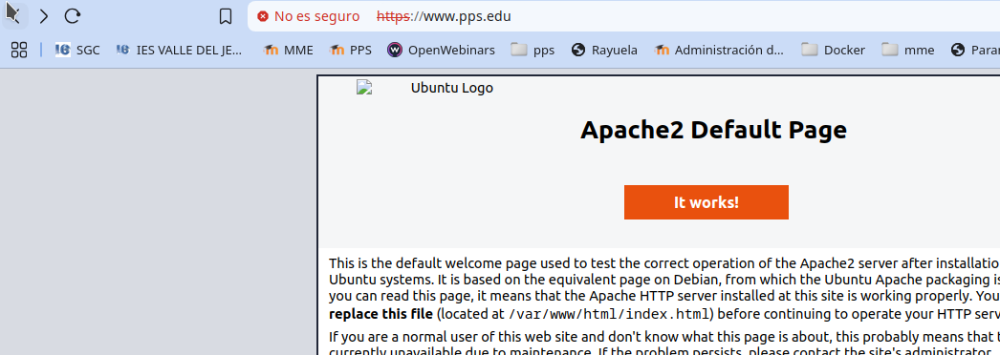
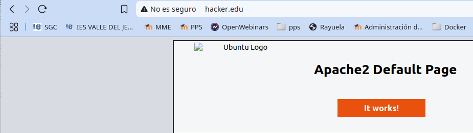

# HTTPS, Hsts, Hardening de servidor web  .
Tenemos como objetivo:

>
> - Conocer cómo configurar un servidor Apache.
> 
> - Conocer el funcionamiento de HTTP y HTTPS.
>
> - Crear certificados en nuestro servidor.
>
> - Saber configurar nuestro servidor para utilizar HTTPS.
>
> - Conocer HTST
>
> - Conocer los Firewall de aplicaciones (WAF)

# ACTIVIDADES A REALIZAR
---
> Lee detenidamente el siguiente documento [para conocer la configuración básica de Apache ](./files/1-Configuracion-Basic-Apache.pdf)
>
> Lee detenidamente el siguiente documento [para conocer las bases del protocolo HTTP ](./files/2-Protocolo-HTTP.pdf)
>
> Lee detenidamente el siguiente [documento para conocer cómo podemos securizar nuestro servidor web ](./files/3-Hardening-Servidor.pdf)
>

Vamos realizando operaciones:

## Iniciar entorno de pruebas

-Situáte en la carpeta de del entorno de pruebas de nuestro servidor LAMP e inicia el escenario docker-compose

~~~
docker-compose up -d
~~~

## Instalación de Apache
---

Cómo estamos utilizando un escenario docker-compose, para acceder a nuestra máquina tendremos que ejecutar:

~~~
docker exec -it lamp-php83 /bin/bash
~~~

Nuestro contenedor que contiene el servicio web, como ves se llama lamp-php83. Si la carpeta donde tienes el escenario tiene otro nombre diferente de lamp, tendrás que cambiar el nombre.

En nuestro servidor ya tenemos instalado Apache, no obstante en cualquier máquina Linux, podemos instalar un servidor Apache, instalando el paquete `apache2`.

~~~
apt update
apt install apache2
~~~

Si no estás utilizando el entorno de pruebas sino otra máquina no estás con usuario `root`es posible que tengas que poner delante de los comandos `sudo`.

 
## Estructura de directorios de configuración Apache

El directorio donde nos encontraremos los archivos de configuración de Apache es `/etc/apache2`. Allí encontraremos los siguientes directorios de configuración que incluyen archivos de configuración (con extensión .conf). 

       /etc/apache2/
       |-- apache2.conf
       |       `--  ports.conf
       |-- mods-enabled
       |       |-- *.load
       |       `-- *.conf
       |-- conf-enabled
       |       `-- *.conf
       `-- sites-enabled
       |        `-- *.conf
       `-- sites-available
               `-- *.conf
#
El archivo de configuración global es `/etc/apache2/apache2.conf`. En él podemos leer detalladamente la configuración explicada.

Los `**Modulos**` son módulos o archivos, que aportan una funcionalidad específica al servidor Apache. Por ejemplo el módulo `ssl.conf` nos sirve para utilizar el protocolo ssl en apache y así utilizar https.

Tenemos el directorio `/etc/apache2/mods-available` donde podemos encontrar todos los módulos disponibles para nuestro servidor (estén o no operativos).

En el directorio `/etc/apache2/mods-enabled` están los módulos que tenemos instalados, o habilitados, es decir los que queremos que nos añadan funcionalidad a apache.

Podemos ver los módulos que tenemos instalados con el comando `apache2ctl -t -D DUMP_MODULES`.

Para añadir la funcionalidad de un módulo a nuestro servidor Apache, utilizamos `a2enmod nombre_modulo`(a2enmod:Apache2 enable module). Por ejemplo para habilitar el módulo ssl utilizaríamos `a2enmod ssl`.

Para deshabilitar la funcionalidad de un módulo lo desinstalamos con `a2dismod nombre_modulo`(a2dismod: Apache2 disable module).

Al igual que con los **módulos** tenemos dos directorios con los archivos de configuración de los **Sotios** o **Servidores Web** que tenemos: 

- En `**/etc/apache2/sites-availacble**` tenemos los archivos de configuración de los diferentes sitios o Servidores web disponibles, independientemente de que se hayan habilitado o no.

- En `/etc/apache2/sites-enabled**`tenemos los archivos de configuración de los sitios o servidores Web habilitados. 

Para habilitar un sitio utilizamos el comando `a2ensite Archivo.conf`. Siendo Archivo.conf la configuración del sitio guardada en el directorio `/etc/apache2/sites-available/`.

Cuando habilitamos un directorio con `a2ensite`(Apache2 enable site), se crea un enlace que apunta al archivo de configuración situado en `/etc/apache2/sites-available`.

## Sitios Virtuales

Para crear un sitio virtual, como podemos intuir, creamos un archivo o modificamos alguno de los archivos existentes en  `**/etc/apache2/sites-availacble**`.

Vamos a modificar el  archivo`**/etc/apache2/sites-availacble/000-default.conf**`. Lo dejamos con este contenido:
~~~
<VirtualHost *:80>

        ServerName www.pps.edu
	ServerAdmin webmaster@localhost
        DocumentRoot /var/www/html

        ErrorLog ${APACHE_LOG_DIR}/error.log
        CustomLog ${APACHE_LOG_DIR}/access.log combined

</VirtualHost>

~~~

Donde podemos ver que encontramos las diferentes variable:

- **ServerName** va a almacenar el nombre de nuestro `host virtual`o `servidor virtual`. Observa que el nombre de nuestro sitio es www.pps.edu.

- En **ServerAdmin** ponemos el correo electrónico del administrador.

- **DocumentRoot** contiene el directorio donde van a estar ubicados los archivos a mostrar en dicho servidor (html, php, etc...)

- Aun que no obligatorio, vemos que  En `ErrorLog` y `CustomLog`podemos indicarles los directorios donde se almacenarán los logs. En este caso van en combinación con la variable de docker `${APACHE_LOG_DIR)` que en nuestro servidor es `/var/log/apache2`.

Una vez creado el archivo de configuración del sitio, lo habilitamos con:

~~~
a2ensite /etc/apache2/sites-availacble/000-default.conf
~~~

**Permisos y propietarios de Directorios de sitios virtuales**

Es muy importante establecer los permisos de los directorios correctamente o puedes encontrarte un error de que no se puede acceder a los archivos del directorio virtual.ç

Cuando un cliente hace una petición a un recurso de nuestro servidor lo hace como un usuario sin autenticar en el sistema, y apache actúa de su parte intentando acceder a dicho recurso con sus credenciales propias, que suelen ser usuario www-data y grupo www-data.

Por lo tanto, suponiendo que no necesitemos subir archivos a nuestro servidor web, para establecer los propietarios y permisos oportunos a los archivos virtuales de nuestro sitio que se encuentran en `/var/www/html` hacemos:

~~~
chown -R www-data:www-data /var/www/html/*
chmod -R 755 /var/www/html/*
~~~

** /etc/hosts **

Nuestro navegador resuleve la dirección www.google.com o cualquier otra asociándole la ip donde se encuentra en el servidor, eso es debido a la resolución de servidores dns.

En el caso de nuestros sitios virtuales, si no están incluidos en los servidores dns, para hacer pruebas en nuestro ordenador, hemos de modificar las rutas en nuestro equipo para que pueda asociar estos nombres (ficticios) con la ip local. 

Debemos editar el fichero hosts para que nos devuelva la dirección del bucle local (127.0.0.1) cuando el navegador pida la url www.pps.net o cualquier otra asociada con un host virtual.

Este fichero está en /etc/hosts.

En los casos asociamos los nombres de los host virtuales a localhost tal y como se muestra en la imagen.

Además en el archivo `/etc/hosts` vemos cómo dirección de nuestro servidor apache. En nuestro caso `172.20.0.5`

No obstante puedes consultarlo en docker con el comando: 

~~~
docker inspect lamp-php83 |grep IPAddress
~~~ 

Si queremos acceder a este servidor virtual desde otros equipos de la red, o si estamos utilizando docker y queremos acceder a ellos desde nuestro navegador, tenemos que añadir en el /etc/hosts una linea que vincule la dirección ip con el nombre del servidor:

**Reiniciar el servicio Apache**

Después de hacer cambios en la configuración de nuestro servidor, si queremos que estos cambios se apliquen, necesitamos recargar la configuración con:

~~~
service apache2 reload
~~~

Ya podemos acceder a nuestro servidor desde:

~~~
http://www.pps.edu/
~~~

## Creación de un servidor virtual Hackker**

Vamos a crear un servidor virtual nuevo para alojar los archivos maliciosos. El directorio estará en `/var/www/hacker` y el nombre del servidor será `www.hacker.edu`

Dentro de este directorio crear una página básica index.html. Puedes descargarte [éste.](./files/index.html)

Creamos directorio, copiamos el archivo y establecemos permisos y propietarios. Finalmente habilitamos sitio y recargamos servicio:
~~~
mkdir /var/www/hacker 
cp /var/www/html/index.html /var/www/hacker/index.html
chown -R www-data:www-data /var/www/hacker
chmod -R 755 /var/www/hacker
a2ensite /etc/apache2/sites-available/hacker.conf
service apache2 reload
~~~

Finalmente creamos el archivo de configuración del sitio:

~~~
<VirtualHost *:80>

    ServerName www.hacker.edu

    ServerAdmin webmaster@localhost
    DocumentRoot /var/www/hacker

    ErrorLog ${APACHE_LOG_DIR}/error.log
    CustomLog ${APACHE_LOG_DIR}/access.log combined

</VirtualHost>

<VirtualHost *:443>
    ServerName www.hacker.edu

    SSLEngine on
    SSLCertificateFile /etc/apache2/ssl/localhost.crt
    SSLCertificateKeyFile /etc/apache2/ssl/localhost.key

    DocumentRoot /var/www/hacker
</VirtualHost>
~~~

Accedemos desde `http://www.hacker.edu`

## **Código seguro**
---

Aquí está el código securizado:

🔒 Medidas de seguridad implementadas

- :

        - 

        - 

🚀 Resultado

✔ 

✔ 

✔ 

## ENTREGA

> __Realiza las operaciones indicadas__

> __Crea un repositorio  con nombre PPS-Unidad3Actividad6-Tu-Nombre donde documentes la realización de ellos.__

> No te olvides de documentarlo convenientemente con explicaciones, capturas de pantalla, etc.

> __Sube a la plataforma, tanto el repositorio comprimido como la dirección https a tu repositorio de Github.__

